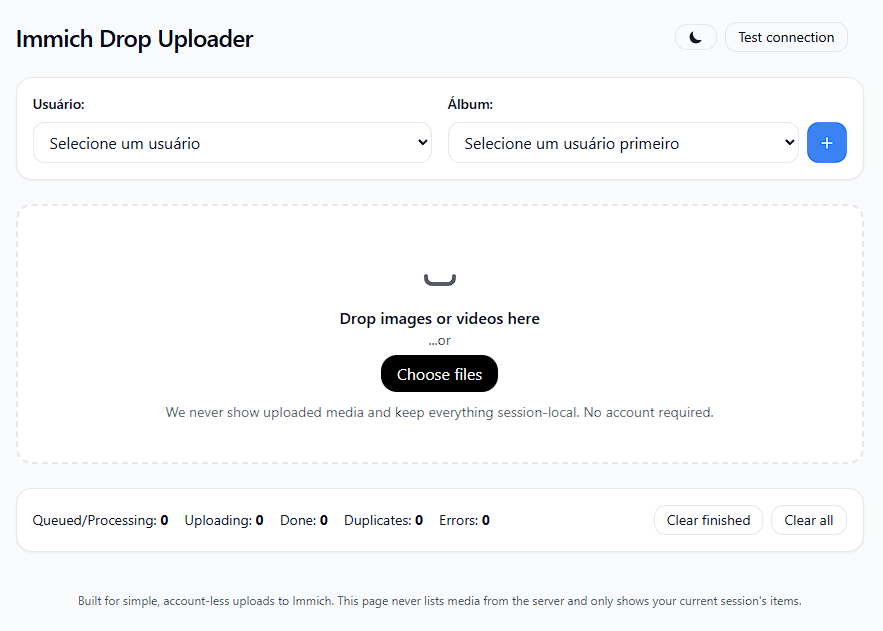

# Immich Drop Uploader - edited version

Cópia modificada do projeto.

## Modificações
- Modificado o Dockerfile para usar imagem para plataforma v8 (raspberry pi) => FROM arm64v8/python:3.11-slim
- Adicionadas opções para selecionar usuário e criar álbum (modificações no fronted e no backend)


---
## Dockerfile
```
# syntax=docker/dockerfile:1.7
FROM arm64v8/python:3.11-slim

WORKDIR /immich_drop

ENV PYTHONDONTWRITEBYTECODE=1 \
    PYTHONUNBUFFERED=1

# Install Python deps
COPY requirements.txt /app/requirements.txt
RUN pip install --no-cache-dir -r /app/requirements.txt \
    && pip install --no-cache-dir python-multipart

# Copy app code
COPY . /immich_drop


# Data dir for SQLite (state.db)
RUN mkdir -p /data
VOLUME ["/data"]

# Defaults (can be overridden via compose env)
ENV HOST=0.0.0.0 \
    PORT=8080 \
    STATE_DB=/data/state.db

EXPOSE 8080

CMD ["python", "main.py"]

```
## users.json
```
{
  "users": [
    {
      "id": "xxxxxx",
      "name": "user1",
      "email": "me@here.com",
      "api_key": "user1apikey"
    },
    {
      "id": "zzz", 
      "name": "user2",
      "email": "metoo@here.com",
      "api_key": "user2apikey"
    }
  ]
}
```
### docker-compose.yml
```yaml
services:
  immich-drop:
    build:
      context: .
      dockerfile: Dockerfile
    container_name: immich-drop
    ports:
      - "8080:8080"
    restart: unless-stopped
    env_file:
      - ./.env
```

### .env 

```
HOST=0.0.0.0
PORT=8080
IMMICH_BASE_URL=http://REPLACE_ME:2283/api
IMMICH_API_KEY=REPLACE_ME
MAX_CONCURRENT=3
IMMICH_ALBUM_NAME=dead-drop  # Optional: auto-add uploads to this album
STATE_DB=/data/state.db
```

### CLI
```bash
docker compose pull
docker compose up -d
```
---

## Architecture

- **Frontend:** static HTML/JS (Tailwind). Drag & drop or "Choose files", queue UI with progress and status chips.  
- **Backend:** FastAPI + Uvicorn.  
  - Proxies uploads to Immich `/assets`  
  - Computes SHA‑1 and checks a local SQLite cache (`state.db`)  
  - Optional Immich de‑dupe via `/assets/bulk-upload-check`  
  - WebSocket `/ws` pushes per‑item progress to the current browser session only  
- **Persistence:** local SQLite (`state.db`) prevents re‑uploads across sessions/runs.

---

## Folder structure

```
immich_drop/
├─ app/                    # FastAPI application (Python package)
│  ├─ __init__.py
│  ├─ app.py               # uvicorn app:app
│  └─ config.py            # loads .env from repo root
├─ frontend/               # static UI served at /static
│  ├─ index.html
│  └─ app.js
├─ main.py                 # thin entrypoint (python main.py)
├─ requirements.txt        # Python deps
├─ .env                    # single config file (see below)
├─ Dockerfile
├─ docker-compose.yml
└─ README.md
```

---

## Requirements

- **Python** 3.11
- An **Immich** server + **API key**
---
## Configuration (.env)

```ini
# Server
HOST=0.0.0.0 
PORT=8080

# Immich connection (include /api)
IMMICH_BASE_URL=http://REPLACE_ME:2283/api
IMMICH_API_KEY=ADD-YOUR-API-KEY   #key needs asset.upload (default functions)

MAX_CONCURRENT=3

# Optional: Album name for auto-adding uploads (creates if doesn't exist)
IMMICH_ALBUM_NAME=dead-drop       #key needs album.create,album.read,albumAsset.create (extended functions)

# Local dedupe cache
STATE_DB=./data/state.db         # local dev -> ./state.db (data folder is created in docker image)
# In Docker this is overridden to /data/state.db by docker-compose.yml
```

You can keep a checked‑in `/.env.example` with the keys above for onboarding.

---

## Mobile notes

- Uses a **label‑wrapped input** + short **ghost‑click suppression** so the system picker does **not** re‑open after tapping **Done** (fixes iOS/Android quirks).  
- Drag‑and‑drop is desktop‑oriented; on touch, use **Choose files**.

---

## Security notes

- The app is **unauthenticated** by design. Share the URL only with trusted people or keep it on a private network/VPN.  
- The Immich API key remains **server‑side**; the browser never sees it.  
- No browsing of uploaded media; only ephemeral session state is shown.

---

## Development

Run with live reload:

```bash
python main.py
```

The backend contains docstrings so you can generate docs later if desired.

---

